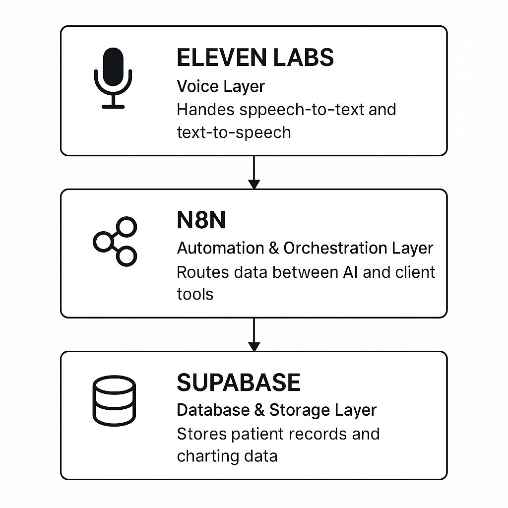
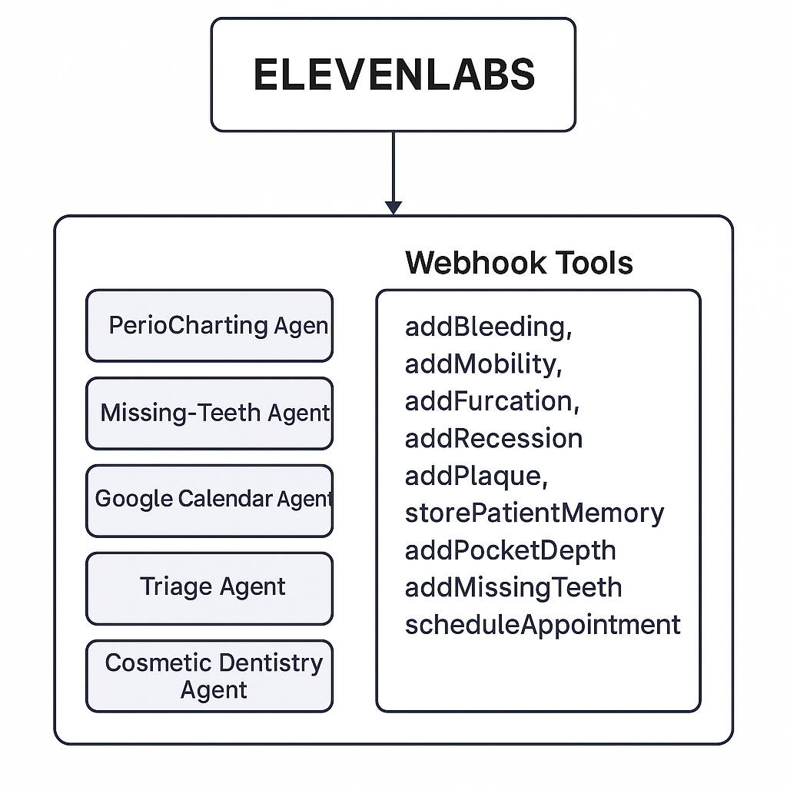
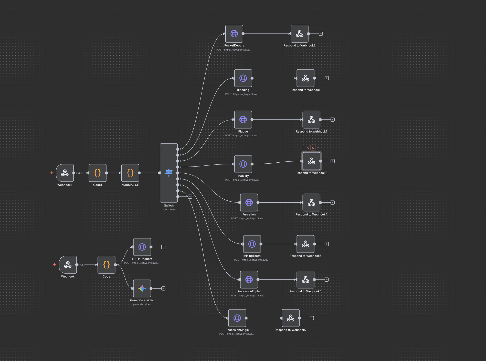

  <h1>Agentic Periodontal Digital Twin</h1>
  
Interactive 3D perio charting with GLB tooth models, voice-driven entry, and automation.

  

## Quick Start

1. Install deps: `npm install`
2. Set `GEMINI_API_KEY` in a `.env.local` file (Vite will inject it)
3. Start dev server: `npm run dev` and open the app

Full 3D model guide and controls: see [TOOTH_MODELS_README.md](TOOTH_MODELS_README.md).

## What’s Inside

- 3D scene with Three.js (`components/PerioChart.tsx`)
- Per-tooth transforms with persistence and UI (`components/ToothTransformControls.tsx`)
- Tooth data entry and AI summary (`components/Tooth.tsx`)
- Model mapping + mirroring (`toothModelMapping.ts`)

## Charting Sequence

## Voice + Tools

## Automation Flow (n8n)

